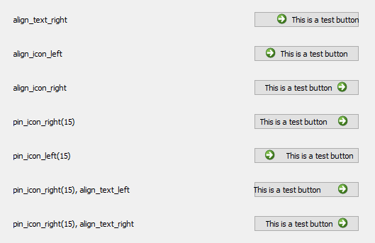
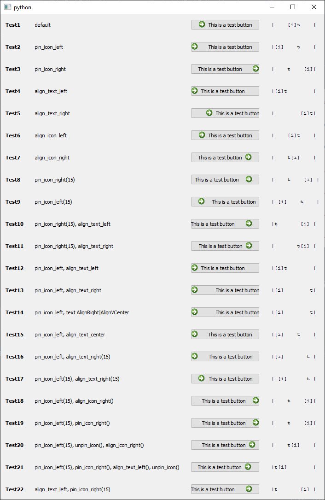

# lqtPushButtonAligned


[](https://github.com/psf/black)


A Qt push button on which you can set in which direction the text and its icon 
is aligned.



# Install

## With poetry

Include this in your `pyproject.toml`

```toml
[tool.poetry.dependencies]
lqtpushbuttonaligned = { git = "https://github.com/MrLixm/lqtPushButtonAligned.git", branch="main" }
```

or a safer choice would be to use a release tag

```toml
[tool.poetry.dependencies]
lqtpushbuttonaligned = { git = "https://github.com/MrLixm/lqtPushButtonAligned.git", tag="v1.0.0" }
```

## Manual

As `lqtPushButtonAligned` is a single module, you can just drop it at a location
registred in your `PYTHONPATH`.

Make sure you have the depencies listed in the `pyproject.toml` installed.

Note that you could remove the `Qt.py` dependencies and just replace the
`from Qt import X` lines with `from PySide2 import X`.


# Usage

`PushButtonAligned` has nearly the same interface as a regular `QPushButton`,
so you could even swap it easily in your codebase.

```python
from Qt import QtWidgets
from lqtPushButtonAligned import PushButtonAligned

app = QtWidgets.QApplication()

icon = app.style().standardIcon(QtWidgets.QStyle.SP_ArrowRight)

# empty button
button = PushButtonAligned()
button.setIcon(icon)
button.setText("some text")
# the above is similar to 
button = PushButtonAligned(icon, "some text")

button.pin_icon_right(15)
button.align_text_right()
# will create something like
#   ┌────────────────┐
#   │     text[icon] │
#   └────────────────┘

# if you wish to edit the icon position after pinning it you need to unpin it
button.unpin_icon()
# will create something like
#   ┌────────────────┐
#   │   [icon]text   │
#   └────────────────┘
```

> [!NOTE]
> To allow PushButtonAligned to behave like a regular QPushButton a few method
> have been overriden, but those methose are not exposed as "slots" by Qt. This
> could lead in theory to unpredictable behavior (which has not been observed yet).

# Developer

## Test

Some manual tests can be run in [mtest_lqtPushButtonAligned.py](tests/mtest_lqtPushButtonAligned.py).

You can perform a manual visual confirmation that the widget behave as expected
in the right rough label.


